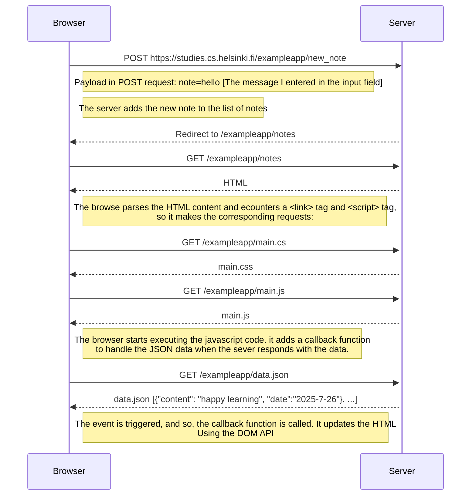

```mermaid
sequenceDiagram
    participant Browser
    participant Server

    Browser->>Server: POST https://studies.cs.helsinki.fi/exampleapp/new_note

    Note right of Browser: Payload in POST request: note=hello [The message I entered in the input field]

    Note right of Browser: The server adds the new note to the list of notes

    activate Server

    Server-->>Browser: Redirect to /exampleapp/notes
    
    
    Browser->>Server: GET /exampleapp/notes

    Server-->>Browser: HTML
    Note right of Browser: The browse parses the HTML content and ecounters a <link> tag and <script> tag, <br>so it makes the corresponding requests:

    Browser->>Server: GET /exampleapp/main.cs
    Server-->>Browser: main.css

    Browser->>Server: GET /exampleapp/main.js
    Server-->>Browser: main.js
    
    Note right of Browser: The browser starts executing the javascript code. it adds a callback function <br>to handle the JSON data when the sever responds with the data. 
    
    Browser->>Server: GET /exampleapp/data.json
    Server-->>Browser: data.json [{"content": "happy learning", "date":"2025-7-26"}, ...]

    Note right of Browser: The event is triggered, and so, the callback function is called. It updates the HTML<br>Using the DOM API

```

