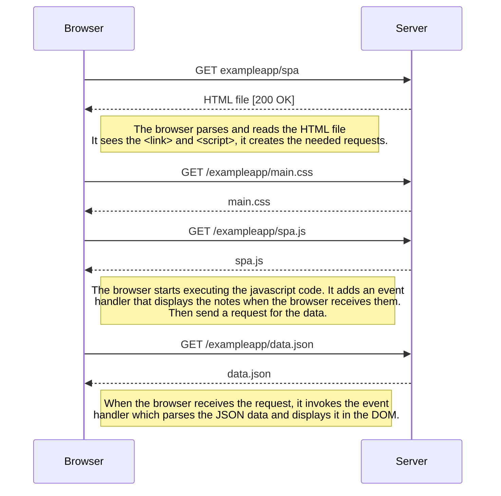

```mermaid
sequenceDiagram
    participant Browser
    participant Server


    Browser->>Server: GET exampleapp/spa


    Server-->>Browser: HTML file [200 OK]
    Note right of Browser: The browser parses and reads the HTML file<br>It sees the <link> and <script>, it creates the needed requests.

    Browser->>Server: GET /exampleapp/main.css
    Server-->>Browser: main.css


    Browser->>Server: GET /exampleapp/spa.js
    Server-->>Browser: spa.js
    Note right of Browser: The browser starts executing the javascript code. It adds an event<br>handler that displays the notes when the browser receives them.<br>Then send a request for the data.

    Browser->>Server: GET /exampleapp/data.json
    Server-->>Browser: data.json


    Note right of Browser: When the browser receives the request, it invokes the event <br>handler which parses the JSON data and displays it in the DOM.
```

