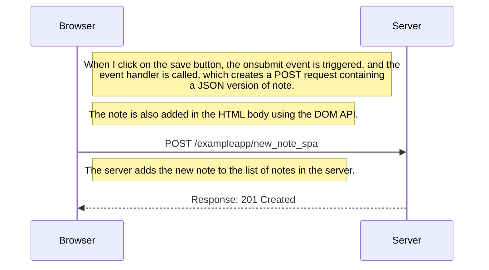

```mermaid
sequenceDiagram
    participant Browser
    participant Server


    Note right of Browser: When I click on the save button, the onsubmit event is triggered, and the<br> event handler is called, which creates a POST request containing <br>a JSON version of note.
    Note right of Browser: The note is also added in the HTML body using the DOM API.

    Browser->>Server: POST /exampleapp/new_note_spa

    Note right of Browser: The server adds the new note to the list of notes in the server.


    Server-->>Browser: Response: 201 Created

```

